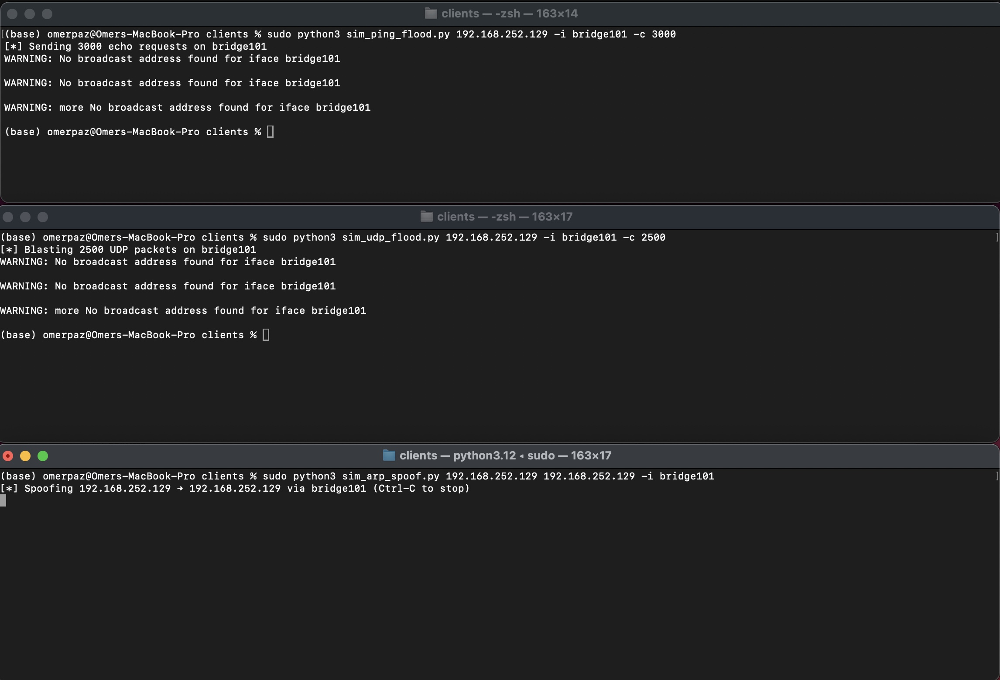
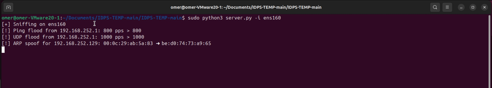

# Mini-IDPS (Intrusion Detection & Prevention System)

A network IDS/IPS written in Python 3 that detects

* **ARP spoofing**
* **ICMP ping floods**
* **UDP floods**

in real‑time on a single Linux host.  It prints console alerts when an attack
is detected, and it ships with three small client scripts that generate each
attack so we can verify that our detector works properly.

---

## Background & Threat Model

### What is an **IDPS**?

An Intrusion Detection and Prevention System passively inspects live network
traffic (detection) and may optionally react (prevention) in order to spot
malicious or anomalous behaviour. Unlike traditional firewalls that rely on
static port/IP rules, an IDPS analyses packet content, rates and
relationships between frames to surface attacks that use legitimate
protocol fields.

Our mini‑IDPS focuses on three classic Layer 2/3 attacks that are easy to
experiment with on a lab LAN.

---

### 1  ARP Spoofing (a.k.a. ARP Poisoning)

**What it is**

A rogue host sends forged ARP Reply packets claiming “IP X is at MAC M.” Victims update their ARP cache and subsequently send traffic to the attacker (Man‑in‑the‑Middle) or to nowhere (DoS).


**Detection logic**

The detector watches (IP → MAC) bindings. If the same IP suddenly advertises a different MAC within `ARP_TABLE_TTL` seconds, it prints an alert.


**Simulator**

`clients/sim_arp_spoof.py <victim‑ip> <gateway‑ip> -i <iface>` repeatedly broadcasts an ARP Reply that maps gateway‑ip to your NIC’s MAC, imitating a typical gateway spoof.

---

### 2  Ping Flood (ICMP Echo Flood)

**What it is**

An attacker bombards a host with a huge number of ICMP Echo Request packets, consuming CPU and bandwidth.


**Detection logic**

The detector keeps a sliding two‑second window per source address. If the packets‑per‑second (`PING_PPS_LIMIT`) exceeds the threshold, an alert fires and the counter is reset.


**Simulator**

`clients/sim_ping_flood.py <target‑ip> -c 10000 -i <iface>` sends 10,000 echo requests as fast as the kernel allows.  Adjust `-c` to scale the attack.

---

### 3  UDP Flood

**What it is**

Similar to a ping flood but protocol‑agnostic: thousands of UDP datagrams per second aim to exhaust link or CPU resources.


**Detection logic**

Same sliding‑window algorithm as the ping detector but applied to all UDP packets; limit is `UDP_PPS_LIMIT`.


**Simulator**

`clients/sim_udp_flood.py <target‑ip> -c 10000 -p 50505 -i <iface>` sends random 64‑byte UDP payloads to the chosen port.

---

## Prerequisites

* Linux kernel with `AF_PACKET` sockets
* Python 3.8 +
* Scapy ≥ 2.5 (installed via `pip`)

---

## Running

```bash
# Start the detector (replace eth0 with your NIC)
$ sudo python server.py -i eth0
[+] Sniffing on eth0
```

Run Ping flood, UDP flood and ARP spoof as shown in Background above.

---

## Configuration (`config.py`)

| Variable           | Purpose                                        | Default  |
| ------------------ | ---------------------------------------------- | -------- |
| `INTERFACE`        | Sniff interface if `-i` not given              | `"eth0"` |
| `FLOOD_WINDOW_SEC` | Sliding‑window length (seconds)                | `2`      |
| `PING_PPS_LIMIT`   | ICMP Echo‑Request rate per source              | `800`    |
| `UDP_PPS_LIMIT`    | UDP packet rate per source                     | `1000`   |
| `ARP_TABLE_TTL`    | Seconds before trusting a new (IP→MAC) mapping | `60`     |

---

## Demo

To demonstrate the system, I set up a virtual machine on my computer with Ubuntu and ran the server on it.
On my computer, I ran the client scripts and attacked the virtual machine.
As can be seen in the images, the attacks were carried out successfully, and the system successfully detected them as well.

**Attacker**



**Victim**
